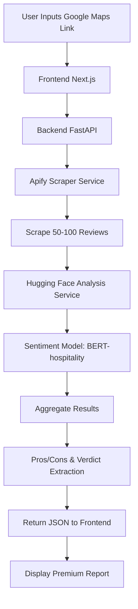

# Hotel Review Analyzer Flow

## System Architecture

1.  **Frontend (Next.js)**:
    - User interface for inputting the URL.
    - Real-time loading states.
    - Premium visualization of pros, cons, and ratings.

2.  **Backend (FastAPI)**:
    - REST API to receive the URL.
    - Orchestrates scraping and analysis.

3.  **Scraper (Apify)**:
    - Uses `google-maps-reviews-scraper` to get high-quality review data.

4.  **Analysis (Hugging Face)**:
    - Model: `Amey9766/BERT-hospitality-review-classifier`.
    - Classifies reviews into sentiment and key themes.

## Environment Variables (.env)

| Variable | Description | Source |
| :--- | :--- | :--- |
| `APIFY_API_TOKEN` | API Token for Apify Scrapers | apify.com |
| `HF_API_TOKEN` | (Optional) For HF Inference API | huggingface.co |
| `BACKEND_URL` | URL for the backend API | Local/Production |
